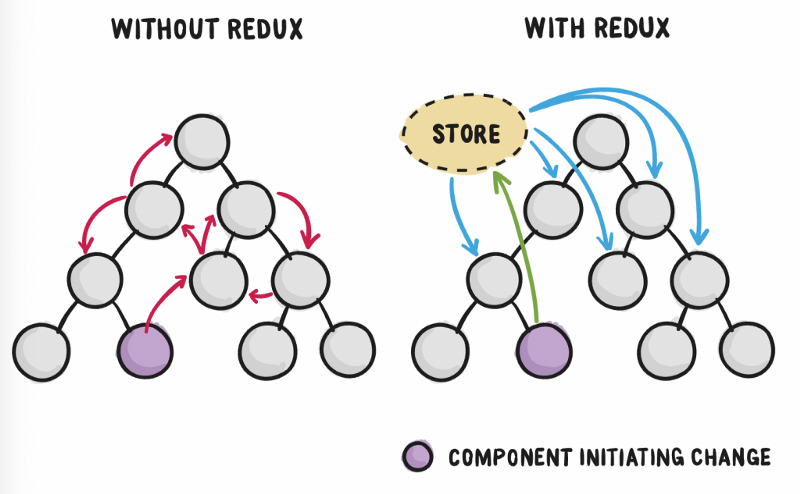
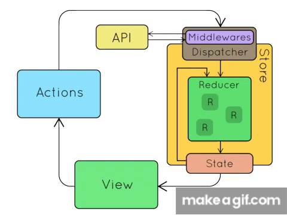

# Redux

# Redux là gì?

- Redux là thư viện state management để quản lý state global

- Redux giúp bạn viết ứng dụng một cái đơn giản và nhất quán, dễ test

# Lý do ra đời những thư viện state management

- Do yêu cầu các ứng dụng Single-Page sử dụng javascript càng ngày càng phức tạp thì code chúng ta sẽ quản lý nhiều state hơn

- Hầu hết các lib, framework như React, Angular, Vue đều được build theo cách sao cho các component tự quản lý state nội bộ mà không cần dùng bất kỳ thư viện or tool nào từ bên ngoài. Nó sẽ hoạt động tốt nếu ứng dụng có ít component. Nhưng khi ứng dụng lớn hơn thì việc quản lý state được chia sẻ qua các component trở thành công việc khó khăn

- Trong một app mà việc chia sẻ state được chia sẻ thủ công thông qua các component sẽ rất dễ nhầ lẫn để chúng ta biết nơi thực sự đang cần

- Với Redux, `state` của ứng dụng được lưu trữ ở 1 nơi gọi là `store` và mỗi component đều có thểu access đến store và lấy bất kỳ giá trị nào mà chúng muốn

# Hiểu cách Redux làm việc

- Các thành phần cơ bản trong Redux

## View

- View chính là thành phần giao diện người dùng, các component React 

- View sẽ là nơi người dùng thấy và thao tác, khi một sự kiện được gọi cần thay đổi `state` trong `store` của Redux

## Actions

- Action là những hành động mà user thông qua UI để gọi lên Redux và thực hiện 1 thao tác nào đó

- 1 Action phải tuân theo quy tắc là 1 object chứa 1 key quan trọng là `type` và `payload` là dạng optional

- 

## Store

- Store là nơi lưu trữ state của Redux

- Người dùng khai báo function reducer và cung cấp cho redux, khi 1 action được truyền vào store, chúng sẽ nhận được 2 tham số là `state` hiện tại và giá trị truyền vào action (type, payload)

- Reducer sẽ trả về giá trị `mới` để cập nhật lại store và store sẽ trả `state` về UI để tiến hành re-render lại UI

## Midleware

- Là thành phần trung gian giữa action và reducer chuyên dùng để xử lý những slide effect, sự kiện bất đồng bộ, api

- Những công việc thường thấy trong middleware có thể là: 

    - Gọi API
    
    - Logger

    - Xử lý những slide effect phức tạp

# Cài đặt, code demo

# Những thường hợp thường sử dụng Redux

- Khi cần lưu trữ state dùng cho nhiều component

- Lưu trữ data, cache dữ liệu khi gọi lần đầu tiên

# So sánh Context và Redux

- Context:

    - Có thể tạo nhiều context, mõi context là 1 store riêng biệt

    - Có thể truyền function

    - Đơn giản, không có quy tắc bắt buộc

- Redux:

    - Tạo nhiều store, nhưng redux sẽ gôm lại làm 1 duy nhất

    - Không thể truyền function mà phải thông qua reducer

    - Setup khó, phù hợp với những ứng dụng lớn, state phức tạp, nhiều thành viên tham gia

--> Lưu ý: Có thể sử dụng kết hợp cả 2 trong 1 dự án