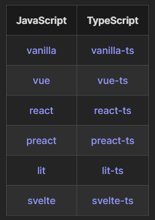

# Lời giới thiệu

- Xin chào các bạn đến với video đầu tiên hướng dẫn học Reactjs

- Trong video này, chúng ta sẽ cùng tìm hiểu cách setup dự án bằng `Vitejs`
- Cách thức code Reactjs thực thi
- Và setup các thành phần thường sử dụng trọng 1 dự án Reactjs
- Ok, chúng ta bắt đầu thôi


# 1. Tạo dự án bằng Vitejs: 

- Vite là một `cli` (command line interface) hỗ trợ lập trình viên code `Reactjs`, `Vuejs` và nhiều loại dự án khác. Vitejs có ưu thế hơn về tốc độ dev so với `create-react-app`. Mọi người có thể tìm hiểu các bài so sánh về 2 thằng này.

- Đây là các project có thể sử dụng Vitejs để setup


- Chúng ta sẽ bật terminal và chạy câu lệnh sau ở folder chứa dự án, tùy chọn 1 trong các công cụ sau:

```properties
    // Chọn một trong các cách sau:

    npm create vite@latest

    yarn create vite

    pnpm create vite


    // di chuyển vào folder dự án với tên my-project
    cd my-project

    // Cài đặt thư viện
    yarn install 

    // Run dự án ở chế độ dev
    yarn dev
```


# 2. Giới thiệu về cách React hoạt động

- Giới thiệu về package.json

    - package.json là file chứa thông tin tổng quan của dự án:

        name: tên dự án

        version: version của dự án

        dependencies: những thư viên sử dụng trong dự án

        devDependencies: Những thư viện hỗ trợ trong quá trình dev

        scripts: Những cli được custom


- index.html -> mọi truy cập từ browser đều vào đây, trong đây sẽ chứa lệnh import

    - main.js -> import file chứa code Reactjs

    - #root -> Element để Reactjs render vào đây -> thử thay đổi #root sang một id khác

- src -> Nơi chứa code chính của React

- main.js -> File chính import vào index.html, từ file sẽ import các file khác. Sẽ không code nhiều trong file này mà đa phần sẽ dùng để setup các Container

- App.js -> File chính chứa code Reactjs


# 3. Tinh gọn, xóa những file không cần thiết

Xóa file: css, logo

# 4. Tạo folder theo Structor dự án

- `public`: external assets

- `assets`: internal assets

- `components`: Component dùng chung
  
- `layouts`: Component dạng layout
  
- `config`: Những config của dự án
  
- `hooks`: custom hook

- `locales`: đa ngôn ngữ

- `pages`: component dạng page

- `services`: chứa các file api

- `stores`: global state

- `utils`: helper