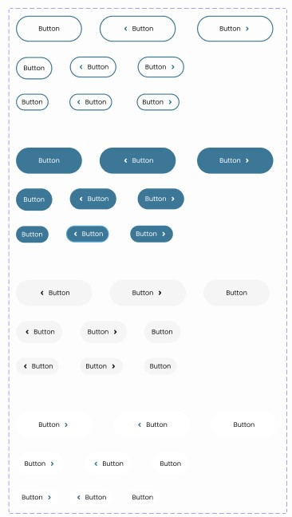
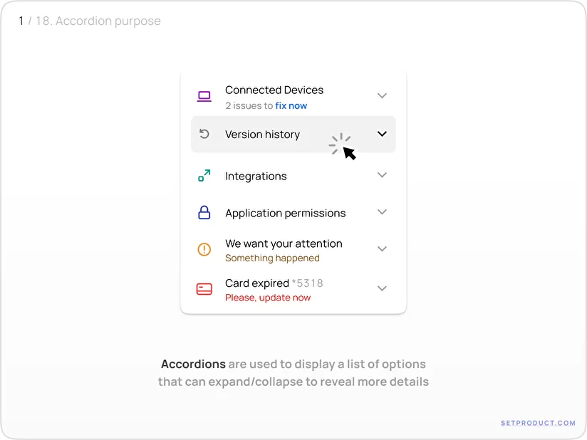
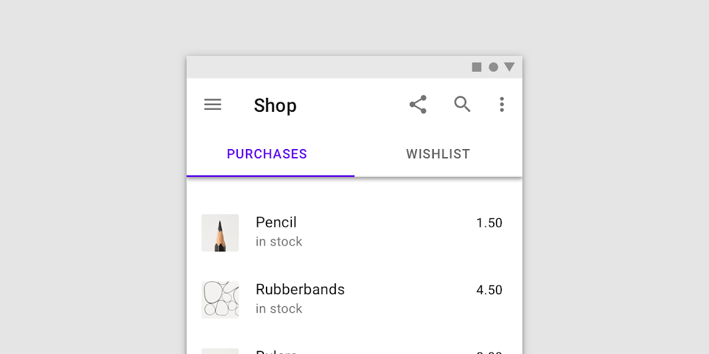
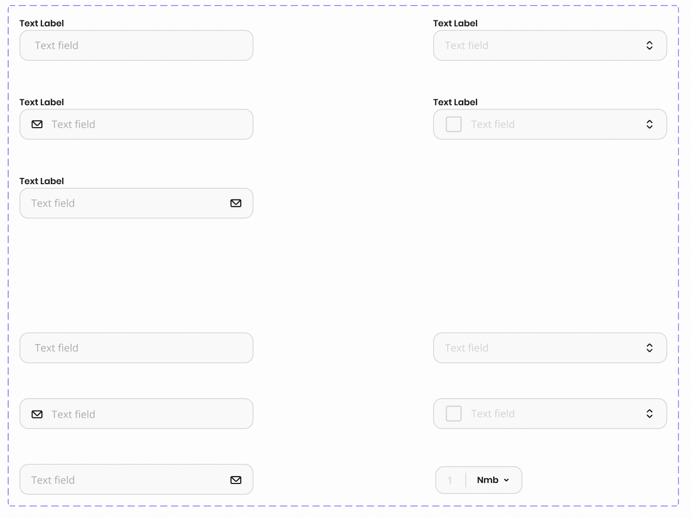

# State trong React

# State là gì?

- `State` là trạng thái của 1 component. Mỗi component sẽ có thể có state (`Stateful Component`) hoặc không có (`Stateless Component`), tùy thuộc vào mục đích của component.

- State có thể thay đổi trong quá trình thực thi (component được render).

- Khi thay đổi state bằng cách sử dụng `setState` của state đó, component sẽ được `re-render` lại, và logic sẽ được thực thi lại. Không khởi tạo lại giá trị của state, lúc này state sẽ giữ giá trị mới --> update giao diện.

- State không được khai báo trong hoặc sau câu điều kiện `if` hoặc trong vòng lặp (`for`, `while`, ...)

- Nên đưa khai báo state lên đầu mỗi component

- `useState` không được dùng ở ngoài component

- Hàm `setState` sẽ kiểm tra giá trị truyền vào, nếu giá trị khác thì component sẽ được `re-render` và ngược lại

```jsx
const Accordion = ({ title, children }) => {
	const [isOpen, setIsOpen] = useState(false);

	const handleTitleClick = () => {
		setIsOpen(!isOpen);
	};

	return (
		<div className={`accordion ${isOpen ? "open" : "hide"}`}>
			<h3 className="title" onClick={handleTitleClick}>
				{title}
			</h3>
			<div className="content">{children}</div>
		</div>
	);
};
```

---> Khi bất kỳ `setState` nào của component được gọi, component sẽ `re-render` (thực thi lại logic trong component). Và các quá trình `initState` sẽ không được thực hiện lại, lúc này state sẽ mang giá trị mới và react sẽ render ra giao diện với state mới

# Sự khác nhau giữa state và props

- **Props**:

  - Không thể thay đổi trong quá trình thực thi

  - Được truyền từ component cha xuống component con

  - Chỉ được thay đổi khi component cha `re-render` lại và truyền xuống 1 props mới

- **State**:

  - Có thể thay đổi trong quá trình thực thi

  - Được khởi tạo trong chính component đó

  - Mỗi lần `setState` lại (thay đổi giá trị của state), chính bản thân component đó sẽ được re-render lại (thực thi lại logic trong component) và state sẽ mang giá trị mới

# Bài tập

1. Tạo component Button
	- Color: bright, colored, simple, stroke

	- Size: Small, medium, large

	- Type: default, icon left, icon right

    

2. Tạo component Accordion

    - Đóng mở content khi click vào title

    - Có hiệu ứng ở icon arrow

    

3. Tạo component Tab

    - Chuyển nội dung khi qua tab khác

    - Có trạng thái active dành cho title

    

4. Tạo component Input, Select

    - Input gồm nhiều size, icon left, right, label, placeholder

    
