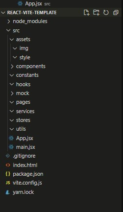

# Ngày 1

- Giới thiệu Reactjs

- Tạo dự án bằng vite

- Cấu trúc thư mục dự án

- Component, Props, State

- useEffect

# 1. Giới thiệu React

- React Js là một thư viện javascript dùng để xây dựng UI, UI ở đây được dùng chính ở 2 nền tảng Web và Mobile. Ở lĩnh vực Web, sử dụng React Js có thể đem lại trải nghiệm tốt cho người dùng, cũng như khả năng Hot Reload giúp bạn lập trình nhanh hơn.

- Ở lĩnh vực mobile, React cũng có phiên bản dành riêng cho Mobile gọi là React Native. Giúp tạo ra các dự án mobile nhanh hơn với nền tảng lập trình chính là Reactjs

- Ngoài React Js, hiện tại còn có các tên tuổi nổi tiếng khác như Angular Js hay Vue Js...

- Hơn nữa, để tăng tốc quá trình phát triển và giảm thiểu những rủi ro có thể xảy ra trong khi coding, React còn cung cấp cho chúng ta khả năng Reusable Code (tái sử dụng code) bằng cách đưa ra 2 khái niệm quan trọng bao gồm:
    - JSX.
    - Virtual DOM.

    # JSX
    -  Trước tiên chúng ta cần hiểu định nghĩa về DOM thực là html được browser render ra UI và user sẽ thấy những gì html thể hiện
    
    
        <figcaption>
        (DOM: Nguồn: https://www.w3schools.com/js/js_htmldom.asp)
        </figcaption>
     
     

    - JSX = Javascript + XML. Là định dạng file mà React sử dụng để hiện thị UI trong code javascript. Với những cú pháp mở rộng cho javascript. Facebook sử dụng JSX để biểu thị UI Component thay vì sử dụng HTML bình thường

    

    # DOM ảo
    
    
    - Thay vì tác động trực tiếp vào DOM thực của website, Reactjs sử dụng DOM ảo (DOM không phải do facebook phát minh ra mà React chỉ sử dụng nó). Reactjs sẽ so sánh tất cả sự thay đổi bên trong component và tiến hành cập nhật lại UI trong trường hợp cần thiết

# 1. Tạo dự án

- Chạy câu lệnh sau, và chọn framework `react`, variant `react`

> npm create vite

- cd đến thư mục dự án và chạy `yarn install`

# 2. Cấu trúc dự án

- `node_modules`: Đây sẽ là nơi chưa các package sau khi chúng ta install

- `index.html`: 

- `assets`: Chứa các file assets như style, image internal (khác image external là những link url được lấy public, api)

- `components`: Chứa các component dung chung của ứng dụng

- `constants`: Chứa các hằng số, config

- `hooks`: Chứa custom hook do user tự định nghĩa

- `mock`: Chứa những dữ liệu giả

- `pages`: Chứa component là từng trang cụ thể trên website

- `services`: Chứa các hàm gọi api, kết nối với BE

- `stores`: Các file state management được đưa vào đây (redux)

- `utils`: Các function helper

- `main.jsx`: File chính của hệ thống, mọi truy cập đến website đều sẽ đi qua file này

# 3. Component, Props, State

- Component là những thành phần UI được chia nhỏ để dễ quản lý hoặc được sử dụng lại ở nhiều nơi trên website

- Có 2 cách khai báo component là class component và function component. Trong khóa học này chúng ta sẽ chỉ học function component

- Cách khai báo 1 function component:

- `CountBox.jsx` là nơi định nghĩa component `CountBox`

- `App.jsx` là nơi import và sử dụng `CountBox`

- Component CountBox có thể tái sử dụng lại, component bắt buộc phải return về một element UI

- Với mỗi props khác nhau, component sẽ sử dụng và nó thực thi các logic cần thiết, trong trường hợp này `color` dùng để thay đổi màu của `div` và `initCount` được dùng để làm giá trị mặc định cho count khi khởi tạo

- Props là ko thể thay đổi, nếu muốn thay đổi giá trị thì giá trị đó phải được thay đổi ở component cha

- State cũng là 1 biến nhưng nó được khai báo trong chính bản thân component đó, state có thể thay đổi khi cần thiết

- Sử dụng `useState` để khai báo 1 state, giá trị trả về là 1 array chứa 2 phần tử là `giá trị` và function setState, trong trường hợp setState được gọi, component sẽ được thực thi lại (gọi là re-render, lifecyle của component) và các logic sẽ được thực thi lại để update ra UI

- Để thay đổi style hoặc handle event chúng ta có thể sử dụng trực tiếp ở những html đó bằng cách truyền vào `style`, `onCLick`, `onChange`,... Mọi attribute có trong html đều được reactjs chuyển thành props với quy tắc `camelCase` tên props

- Sử dụng const để khai báo state để ngăn không cho thay đổi state trực tiếp

- Nên khai báo state ở dưới lời khai báo component, sau đó là useEffect rồi đến các giá trị khác

# 4. useEffect

- useEffect là 1 hook (tên function bắt đầu bằng `use`) cơ bản do React định nghĩa

- useEffect có 2 tham số, `callback` và `dependencyList` (array).

- Khi component được re-render lại, useEffect sẽ tùy thuộc vào sự thay đổi của `dependencyList` mà quyết định xem có nên thực hiện lại hàm `callback` hay không

- useEffect sẽ luôn được thực thi ở lần đầu tiên khi render component

- useEffect nên luôn luôn có dependencyList hoặc array rỗng

# Bài tập trên lớp: 

- CountBox giống bài giảng và hiểu các thành phần trong nó: state, props, useEffect, style, event

# Bài tập về nhà:

- Thực hiện các component sau dựa theo design figma: 

    - Button
    
    - Input
    
    - Checkbox
    
    - Select