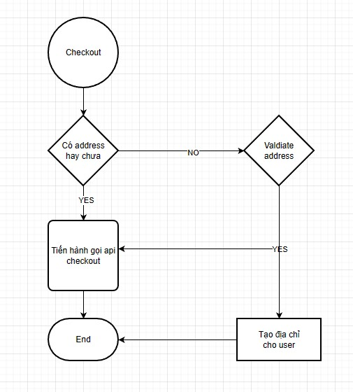

# Checkout

[ ] Load thông tin sản phẩm pre checkout

    - Khi user không chọn sản phẩm nào thì redirect về trang gio-hang

[ ] Xử lý Shipping address

    - Lấy mặc định address default làm địa chỉ shipping

    - Thay đổi địa chỉ giao hàng

    - Lưu địa chỉ giao hàng khi user refresh page

    - Trong trường hợp user chưa có "sổ địa chỉ" nào thì xuất hiện form nhập địa chỉ giống trong trang cá nhân

    - Xóa thông tin shipping address khi user logout

[ ] Shipping method

    - Lấy danh sách shipping

    - Thay đổi shipping method tiến hành tính lại giá tiền

[ ] Xử lý khi user logout

    - Clear cart, preCheckoutData, preCheckoutRequest, address

    - Redirect khi user chưa chọn sản phẩm để checkout

[ ] Tiến hành checkout

[ ] Clear thông tin sau khi checkout thành công